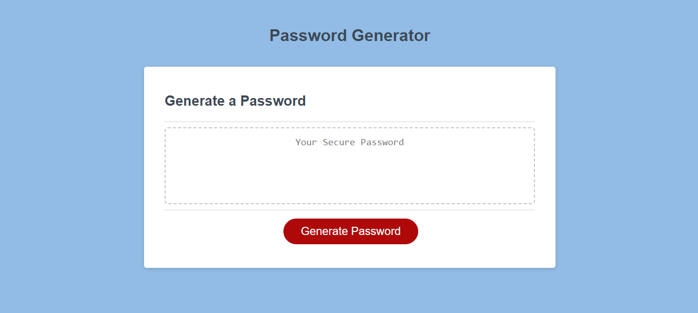
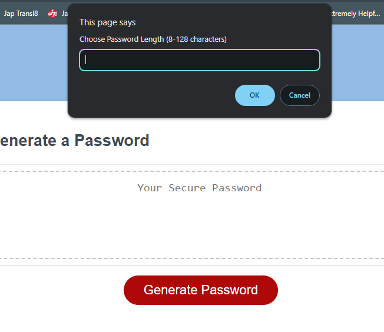
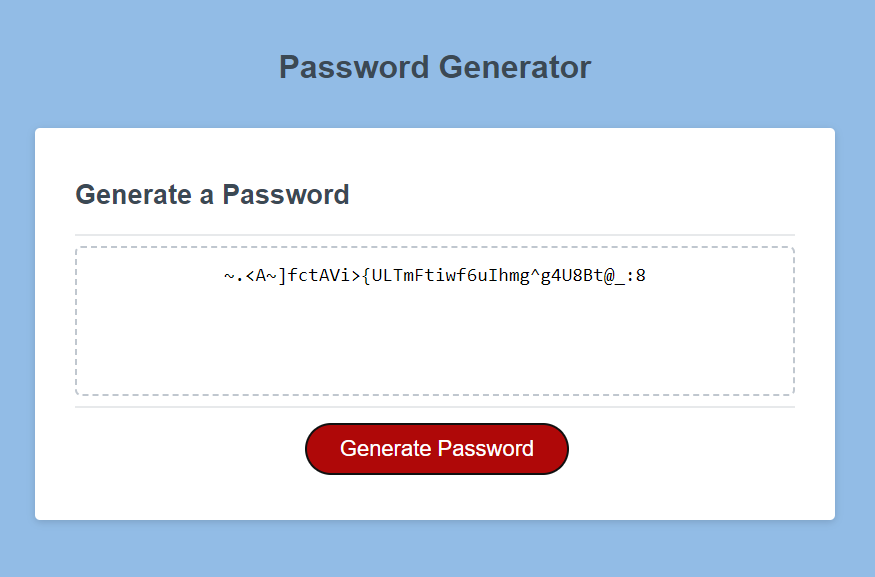

# Password Generator Starter Code

## Description 
This project is a page with the task of generating a password based on a user's preferred parameters. If you're having trouble deciding on a password, why not solve this issue by handing the task to a random generator? The project explores javascript, specifically arrays, and functions related to it. A "for loop" and an "if else" statement are also used. The prompt() and confirm() methods were also used to gather user input, and logical operators were used to validate input. The combination of the aforementioned code was learned to finalize this working web application. If you're interested in a more detailed explanation, check out the javascript file in the project directory.

Provide a short description explaining the what, why, and how of your project. Use the following questions as a guide:

## Installation
N/A

## Usage Images
**Img 1**

**Img 2**

**Img 3**

## Usage
Visit Page: -link to the live page-

When you first open the page, you can see an empty box where a password will be generated and shown once you press the "Generate Password" button below the box **(Img 1)** .

 After the button is pressed you will be prompted with requests for your desired password parameters. You will be prompted with a request for password length between 8 and 138 characters, followed by a lowercase, uppercase, special characters, and number prompts that the user can select from **(Img 2)**. 
 
 After all prompts are answered, a new password will be generated in the previously empty box **(Img 3)**. 

## Credits
Original starter code repository: __friendly-parakeet__ from https://github.com/coding-boot-camp

Password generator source explanation:
https://www.youtube.com/watch?v=x4HUaiazDes&ab_channel=PaulKeldsen-WebDevelopment

Javascript generator tutorial:
https://www.youtube.com/watch?v=v2jfGo7ztm8&t=1080s&ab_channel=DanielVega

NaN Javascript property:
https://www.w3schools.com/jsref/jsref_number_nan.asp#:~:text=In%20JavaScript%2C%20NaN%20is%20short,the%20same%20as%20the%20Number.

## License
MIT License

Copyright (c) [2023] [Eduardo Perez]

Permission is hereby granted, free of charge, to any person obtaining a copy
of this software and associated documentation files (the "Software"), to deal
in the Software without restriction, including without limitation the rights
to use, copy, modify, merge, publish, distribute, sublicense, and/or sell
copies of the Software, and to permit persons to whom the Software is
furnished to do so, subject to the following conditions:

The above copyright notice and this permission notice shall be included in all
copies or substantial portions of the Software.

THE SOFTWARE IS PROVIDED "AS IS", WITHOUT WARRANTY OF ANY KIND, EXPRESS OR
IMPLIED, INCLUDING BUT NOT LIMITED TO THE WARRANTIES OF MERCHANTABILITY,
FITNESS FOR A PARTICULAR PURPOSE AND NONINFRINGEMENT. IN NO EVENT SHALL THE
AUTHORS OR COPYRIGHT HOLDERS BE LIABLE FOR ANY CLAIM, DAMAGES OR OTHER
LIABILITY, WHETHER IN AN ACTION OF CONTRACT, TORT OR OTHERWISE, ARISING FROM,
OUT OF OR IN CONNECTION WITH THE SOFTWARE OR THE USE OR OTHER DEALINGS IN THE
SOFTWARE.

---